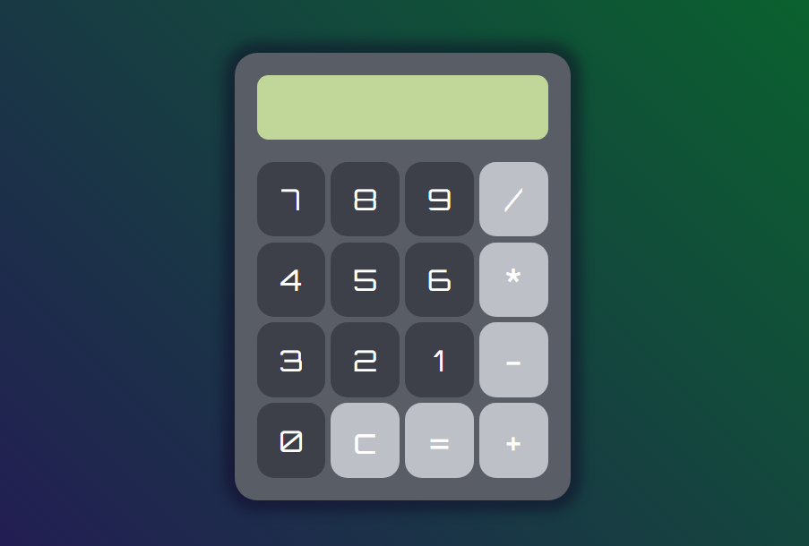
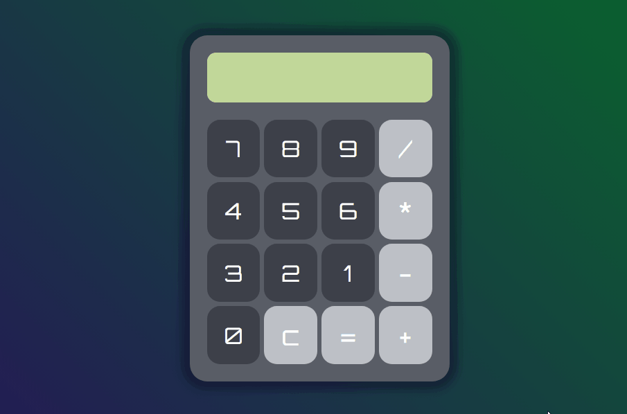

# Simple Calculator

### About Project
___

Training project. Built to practice __JavaScript__. List of technologies used:
* ___HTML___
* ___CSS___
* ___JS___

_Simple calculator. Stores the value of the calculation for further manipulation with it. Button to clear the entire queue. Also some styling and hover effect._

__**My contacts:**__

[Telegram](https://t.me/eurokot)
[Instagram](https://www.instagram.com/sadpage.js/)
<a href='mailto:eurokot_dev@mail.ru'>Email</a>

__[Up](#anchor)__